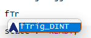

# SIGMATEK-Jumag-Utils
A collection of c-style functions for SIGMATEK Lasal Class 2. For using the functions of this library you have to move the .c files which you need in your ```Source/``` folder of  your project.


# How to use C Files in Lasal Class 2


## How to include C Files 
* right click on your class and choose "Add Files"
* choose the C File which you moved in your ```Source/``` folder


## Declaring C Functions in Lasal Class 2
* finally you have to declare the functions in your class in Lasal Class 2.
* you can easly copy the multi line comment from the C File and paste it in your ST Code of Lasal Class 2


* after declaring in ST Code it's recommandable to compile the project, after that the auto completion will suggest you the functions 
* if you commit the suggestion with the enter button the auto completion is creating the function with all necessary parameters 
* if you hover over the function you will see the expected datatypes of the parameters

# Help Documents for the Functions of this library
* [Delay](docs/delay.md)
* [Two Point Controller](docs/twoPointController.md)
* [Scaling](docs/scaling.md)
* [Edge Detection](docs/edgeDetection.md)
* [Function Trigger](docs/functionTrigger.md)
* [Pseudo Randomizer](docs/linearCongruentialGenerator.md)
* [Datatype manipulation](docs/typeManipulation.md)
* [Math Functions](docs/math.md)
* [Steam formula: Antoine equation](docs/antoineFormular.md)
