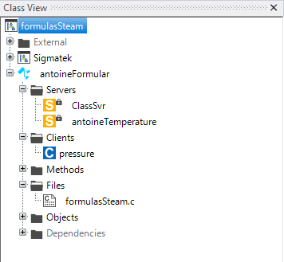

# Antoine Formular
The antoine formular allows to calculate the steam temperatue by the steam pressure. 
For more information about the antoine formular click [here](https://en.wikipedia.org/wiki/Antoine_equation).


- [Antoine Formular](#antoine-formular)
  - [Syntax in Lasal Class 2](#syntax-in-lasal-class-2)
    - [Rising Edge Detection](#rising-edge-detection)
  - [Lasal Class 2 Example](#lasal-class-2-example)
    - [ST Code](#st-code)
    - [Class View](#class-view)

## Syntax in Lasal Class 2

### Rising Edge Detection
```
Q : REAL = antoineFormT(INPUT : REAL)
```

| Argument | Datatype | Meaning |
| ------------- | ------------- | ------------- |
| INPUT  | REAL | pressure in bar |


## Lasal Class 2 Example
* You can find a compialable example by clicking here: [Example](https://github.com/Jumag-Dampferzeuger-GmbH/SIGMATEK-Jumag-Utils-Examples/tree/main/formulasSteam)

### ST Code

```
Function Global __cdecl antoineFormT
VAR_INPUT
  INPUT : REAL;
END_VAR
VAR_OUTPUT
  Q : REAL;
END_VAR;

FUNCTION VIRTUAL GLOBAL antoineFormular::CyWork
	VAR_INPUT
		EAX 	: UDINT;
	END_VAR
	VAR_OUTPUT
		state (EAX) 	: UDINT;
	END_VAR
  
  pressure := pressure.Read();
  
  antoineTemperature := antoineFormT(INPUT:= to_real(pressure) );

	state := READY;

END_FUNCTION
```


### Class View

