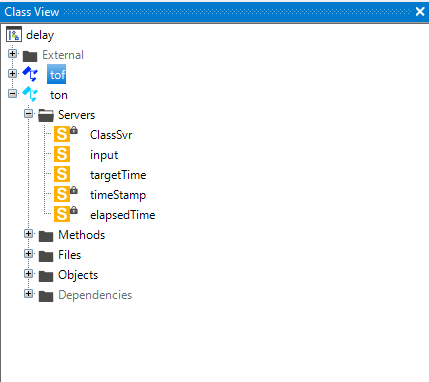

# Delay 
The ton and tof functions are used for delaying signals. 

- [Delay](#delay)
  - [Syntax in Lasal Class 2](#syntax-in-lasal-class-2)
    - [DelayTof](#delaytof)
    - [DelayTon](#delayton)
    - [Lasal Class 2 Example](#lasal-class-2-example)
    - [ST Code](#st-code)
    - [Class View](#class-view)

## Syntax in Lasal Class 2

### DelayTof
* If the input signal is falling from true to false the output signal will be true for the time of PT. The output is immediately true if the input signal is true.
```
Q : BOOL = DelayTof(IN : BOOL, PT : DINT , ET: ^UDINT , TIMESTAMP: ^UDINT, CLOCK : UDINT)
```

| Argument | Datatype | Meaning |
| ------------- | ------------- | ------------- |
| IN  | BOOL | Input signal |
| PT  | DINT | Time in ms |
| ET  | ^UDINT | Pointer to the elapsed time |
| TIMESTAMP  | ^UDINT | Pointer to the timestamp for saving the  ```ops.tAbsolute```  time|
| CLOCK  | UDINT | Clock signal ```ops.tAbsolute``` |
| Q  | BOOL | Output signal |

### DelayTon
* if the input signal is switching from false to true the output is true after reaching the time PT. If the input signal is switching to false the output will be immediately false.


```
Q : BOOL = DelayTon(IN : BOOL, PT : DINT , ET: ^UDINT , TIMESTAMP: ^UDINT, CLOCK : UDINT)
```

| Argument | Datatype | Meaning |
| ------------- | ------------- | ------------- |
| IN  | BOOL | Input signal |
| PT  | DINT | Time in ms |
| ET  | ^UDINT | Pointer to the elapsed time |
| TIMESTAMP  | ^UDINT | Pointer to the timestamp for saving the  ```ops.tAbsolute```  time|
| CLOCK  | UDINT | Clock signal ```ops.tAbsolute``` |
| Q  | BOOL | Output signal |


### Lasal Class 2 Example
* You can find a compialable example by clicking here: [Example](https://github.com/Jumag-Dampferzeuger-GmbH/SIGMATEK-Jumag-Utils-Examples/tree/main/delay)

### ST Code

```

Function Global __cdecl DelayTon
VAR_INPUT
  IN : BOOL;
  PT : DINT;
  ET : ^UDINT;
  TIMESTAMP : ^UDINT;
  CLOCK : UDINT;
END_VAR
VAR_OUTPUT
  Q : BOOL;
END_VAR;


FUNCTION VIRTUAL GLOBAL ton::CyWork
	VAR_INPUT
		EAX 	: UDINT;
	END_VAR
	VAR_OUTPUT
		state (EAX) 	: UDINT;
	END_VAR
  VAR
  	x : BOOL; 
  END_VAR


  if (input = 1)  then
    x := true; 
    else 
      x := false; 
  end_if;

  
  ClassSvr := DelayTon(IN:=x, PT:=targetTime, ET:=#elapsedTime, TIMESTAMP:=#timeStamp, CLOCK:=ops.tAbsolute);

	state := READY;

END_FUNCTION

```


### Class View

