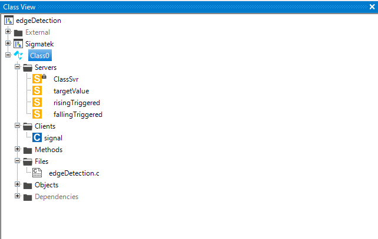

# Edge Detection
This funtion is similiar to R_TRIG and F_TRIG of Codesys and is used to detect a rising or falling edge of a ```DINT``` variable. 


- [Edge Detection](#edge-detection)
  - [Syntax in Lasal Class 2](#syntax-in-lasal-class-2)
    - [Rising Edge Detection](#rising-edge-detection)
    - [Falling Edge Detection](#falling-edge-detection)
  - [Lasal Class 2 Example](#lasal-class-2-example)
    - [ST Code](#st-code)
    - [Class View](#class-view)

## Syntax in Lasal Class 2
* this function needs a locale ```^DINT``` Pointer in the Class

### Rising Edge Detection
```
Q : BOOL = rTrig_DINT(DINT : INPUT, ^DINT : PREV, DINT : TRIGGER)
```

| Argument | Datatype | Meaning |
| ------------- | ------------- | ------------- |
| INPUT  | DINT | Your 0/1 value or analog signal which should be triggered |
| PREV  | ^DINT  | locale pointer variable for storing the old signal value  |
| TRIGGER  | DINT  | target trigger value |

### Falling Edge Detection
```
Q : BOOL = fTrig_DINT(DINT : INPUT, ^DINT : PREV, DINT : TRIGGER)
```

| Argument | Datatype | Meaning |
| ------------- | ------------- | ------------- |
| INPUT  | DINT | Your 0/1 value or analog signal which should be triggered |
| PREV  | ^DINT  | locale pointer variable for storing the old signal value  |
| TRIGGER  | DINT  | target trigger value |


## Lasal Class 2 Example
* You can find a compialable example by clicking here: [Example](https://github.com/Jumag-Dampferzeuger-GmbH/SIGMATEK-Jumag-Utils-Examples/tree/main/edgeDetection)

### ST Code

```
Function Global __cdecl rTrig_DINT
VAR_INPUT
  INPUT : DINT;
  PREV : ^DINT;
  TRIGGER : DINT;
END_VAR
VAR_OUTPUT
  result : BOOL;
END_VAR;

Function Global __cdecl fTrig_DINT
VAR_INPUT
  INPUT : DINT;
  PREV : ^DINT;
  TRIGGER : DINT;
END_VAR
VAR_OUTPUT
  result : BOOL;
END_VAR;

FUNCTION VIRTUAL GLOBAL Class0::CyWork
	VAR_INPUT
		EAX 	: UDINT;
	END_VAR
	VAR_OUTPUT
		state (EAX) 	: UDINT;
	END_VAR
  

  
  signal := signal.Read();
  
  risingTriggered := rTrig_DINT(INPUT:= signal, PREV:= #oldSignal0, TRIGGER:= targetValue);

  fallingTriggered := fTrig_DINT(INPUT:= signal, PREV:= #oldSignal1, TRIGGER:= targetValue);
  
	state := READY;

END_FUNCTION

```


### Class View
