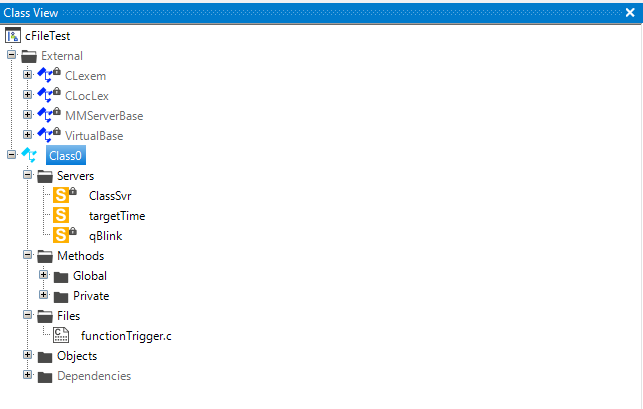

# Function Trigger
Triggering a function at a specific time. 
If the time is reached the return value is true and the time stamp is stored in the locale pointer variable in Lasal Class 2

- [Function Trigger](#function-trigger)
  - [Syntax in Lasal Class 2](#syntax-in-lasal-class-2)
  - [Lasal Class 2 Example](#lasal-class-2-example)
    - [ST Code](#st-code)
    - [Class View](#class-view)

## Syntax in Lasal Class 2
```
Q : BOOL = functionTrigger(UDINT : CURR_TIME, TIME_STAMP : ^UDINT, TAR_TIME : UDINT)
```
* this function needs a locale ```^UDINT``` Pointer in the Class

| Argument | Datatype | Meaning |
| ------------- | ------------- | ------------- |
| CURR_TIME  | UDINT | ops.tAbsolute  |
| TIME_STAMP  | ^UDINT  | locale pointer variable for storing the time stamp  |
| TAR_TIME  | UDINT  | the target time in ms  |

## Lasal Class 2 Example
* You can find a compialable example by clicking here: [Example](https://github.com/Jumag-Dampferzeuger-GmbH/SIGMATEK-Jumag-Utils-Examples/tree/main/functionTrigger)

### ST Code

```
// Declaration of C Function
Function Global __cdecl functionTrigger
VAR_INPUT 
  CURR_TIME : UDINT;
  TIME_STAMP : ^UDINT;
  TAR_TIME : UDINT;
END_VAR
VAR_OUTPUT
  Q : BOOL;
END_VAR;


FUNCTION VIRTUAL GLOBAL Class0::CyWork
	VAR_INPUT
		EAX 	: UDINT;
	END_VAR
	VAR_OUTPUT
		state (EAX) 	: UDINT;
	END_VAR

  
   
  
  if (functionTrigger(CURR_TIME := ops.tAbsolute, TIME_STAMP := functionTimeStamp, TAR_TIME := 1000)) then
    qblink := true;
  else
    qBlink := false; 
  end_if;
  

	state := READY;

END_FUNCTION


```


### Class View

