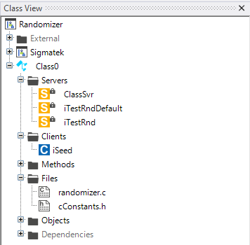

# Linear Congruential Generator
The linear congruential generator is a simple algorithm that generates a sequence of pseudo-randomized numbers calculated with a discontinuous piecewise linear equation. The method represents one of the oldest and best-known pseudorandom number generator algorithms. The theory behind them is easy to understand, and they are easily implemented and fast, especially on computer hardware which can provide modulo arithmetic by storage-bit truncation.

For more information about the linear congruential generator, please visit: [Linear Congruential Generator](https://en.wikipedia.org/wiki/Linear_congruential_generator)

Please consider that each linear generator is not a cryptographically secure pseudo-random number generator. For more information about cryptographically secure pseudo-random number generator, please visit: [Cryptographically secure pseudo-random number generator](https://en.wikipedia.org/wiki/Cryptographically_secure_pseudo-random_number_generator)

- [Linear Congruential Generator](#linear-congruential-generator)
  - [Syntax in Lasal Class 2](#syntax-in-lasal-class-2)
  - [Lasal Class 2 Example](#lasal-class-2-example)
    - [ST Code](#st-code)
    - [Class View](#class-view)

## Syntax in Lasal Class 2

```
Q : DINT = linCongGen(DINT : INPUT, DINT : FACTOR, DINT : INCREMENT, DINT : MODULO)
```
| Argument | Datatype | Meaning |
| ------------- | ------------- | ------------- |
| INPUT  | DINT | Start Value |
| FACTOR  | DINT  | linear factor |
| INCREMENT  | DINT  | linear addition  |
| MODULO  | DINT  | limiting the output |

## Lasal Class 2 Example
* You can find a compialable example by clicking here: [Example](https://github.com/Jumag-Dampferzeuger-GmbH/SIGMATEK-Jumag-Utils-Examples/tree/main/randomizer)

### ST Code

```
Function Global __cdecl linCongGen
VAR_INPUT 
  INPUT : DINT;
  FACTOR : DINT; 
  INCREMENT : DINT; 
  MODULO : DINT; 
END_VAR
VAR_OUTPUT
  result : DINT;
END_VAR;


FUNCTION VIRTUAL GLOBAL Class0::CyWork
	VAR_INPUT
		EAX 	: UDINT;
	END_VAR
	VAR_OUTPUT
		state (EAX) 	: UDINT;
	END_VAR

  iSeed := iSeed.Read();

  iTestRndDefault := linCongGen(INPUT:=iSeed, FACTOR:=0, INCREMENT:=0, MODULO:=0);  // linear congruential generator with default parameters
  iTestRnd := linCongGen(INPUT:=iSeed, FACTOR:=10, INCREMENT:=42, MODULO:=9000);
  
  
  
	state := READY;

END_FUNCTION


```
### Class View
