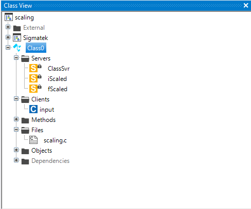

# Scaling
The scaling function is used to scale a value from one range to another range. This function is often used to scale analog values from a sensor to a value that can be used in the PLC. For example, theresistance of an potentio meter can be scaled from 0-5000 Ohm to 0-100 %.

This function is also used to scale values from one unit to another. For example, a value in meters can be scaled to a value in millimeters.

Depending of the input datatyoe you have to choose the right function.


- [Scaling](#scaling)
  - [Syntax in Lasal Class 2](#syntax-in-lasal-class-2)
    - [map](#map)
    - [fMap](#fmap)
    - [Lasal Class 2 Example](#lasal-class-2-example)
    - [ST Code](#st-code)
    - [Class View](#class-view)

## Syntax in Lasal Class 2

### map
```
Q : DINT = map(DINT : input, DINT : inLow, DINT : inHigh, DINT : outLow, DINT : outHigh)
```
| Argument | Datatype | Meaning |
| ------------- | ------------- | ------------- |
| INPUT  | DINT | Your input value |
| I_LO  | DINT  | Your input value range low  |
| I_HI  | DINT  | Your input value range high  |
| O_LO  | DINT  | Your output value range low  |
| O_HI  | DINT  | Your output value range high  |


### fMap
```
result : REAL = fMap(REAL : input, REAL : inLow, REAL : inHigh, REAL : outLow, REAL : outHigh)
```

| Argument | Datatype | Meaning |
| ------------- | ------------- | ------------- |
| INPUT  | REAL | Your input value |
| I_LO  | REAL  | Your input value range low  |
| I_HI  | REAL  | Your input value range high  |
| O_LO  | REAL  | Your output value range low  |
| O_HI  | REAL  | Your output value range high  |


### Lasal Class 2 Example
* You can find a compialable example by clicking here: [Example](https://github.com/Jumag-Dampferzeuger-GmbH/SIGMATEK-Jumag-Utils-Examples/tree/main/scaling)

### ST Code

```
Function Global __cdecl map
VAR_INPUT
  INPUT : DINT;
  I_LO : DINT;
  I_HI : DINT;
  O_LO : DINT;
  O_HI : DINT;
END_VAR
VAR_OUTPUT
  Q : DINT;
END_VAR;

Function Global __cdecl fMap
VAR_INPUT
  INPUT : REAL;
  I_LO : REAL;
  I_HI : REAL;
  O_LO : REAL;
  O_HI : REAL;
END_VAR
VAR_OUTPUT
  Q : REAL;
END_VAR;

FUNCTION VIRTUAL GLOBAL Class0::CyWork
	VAR_INPUT
		EAX 	: UDINT;
	END_VAR
	VAR_OUTPUT
		state (EAX) 	: UDINT;
	END_VAR
  
  input := input.Read();
  
  iScaled := map(INPUT:= input, i_LO:= -200, I_HI:=200, O_LO:= 0, O_HI:= 100);
  fScaled := fMap(INPUT:= TO_REAL(input), I_LO:= TO_REAL(-200), I_HI:= TO_REAL(200), O_LO:= 0.0, O_HI:= 1000.0);


	state := READY;

END_FUNCTION
```


### Class View
