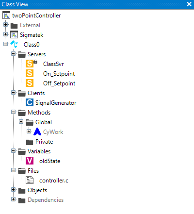

# Two Point Controller
The Two Point Controller is a simple controller that switches between two values. The controller is used to control a binary output. The controller switches between the two values depending on the input value. The controller is often used to control a binary output like a relay or a valve.


- [Two Point Controller](#two-point-controller)
  - [Syntax in Lasal Class 2](#syntax-in-lasal-class-2)
    - [map](#map)
    - [Lasal Class 2 Example](#lasal-class-2-example)
    - [ST Code](#st-code)
    - [Class View](#class-view)

## Syntax in Lasal Class 2

### map
```
Q : BOOL = twoPointCtrl(DINT : input, DINT : ON_Setpoint, DINT : OFF_Setpoint, ^BOOL : pOld)
```
| Argument | Datatype | Meaning |
| ------------- | ------------- | ------------- |
| INPUT  | DINT | Your input value |
| ON_Setpoint  | DINT  | Your setpoint for switching on  |
| OFF_Setpoint  | DINT  | Your Setpoint for switching off |
| pOld  | ^BOOL  | Pointer of Bool which saves the old value for realizing the hysteresis  |


### Lasal Class 2 Example
* You can find a compialable example by clicking here: [Example](https://github.com/Jumag-Dampferzeuger-GmbH/SIGMATEK-Jumag-Utils-Examples/tree/main/twoPointController)

### ST Code

```
Function Global __cdecl twoPointCtrl
VAR_INPUT
  INPUT : DINT;
  ON_Setpoint : DINT;
  OFF_Setpoint : DINT;
  pOld : ^BOOL;
END_VAR
VAR_OUTPUT
  Q : BOOL;
END_VAR;

FUNCTION VIRTUAL GLOBAL Class0::CyWork
	VAR_INPUT
		EAX 	: UDINT;
	END_VAR
	VAR_OUTPUT
		state (EAX) 	: UDINT;
	END_VAR
  
  SignalGenerator := SignalGenerator.Read();
  
  ClassSvr := twoPointCtrl( INPUT := SignalGenerator, 
                            ON_Setpoint:= On_Setpoint, 
                            OFF_Setpoint:= Off_Setpoint, 
                            pOld:= #oldState);
  
  

	state := READY;

END_FUNCTION
```


### Class View
